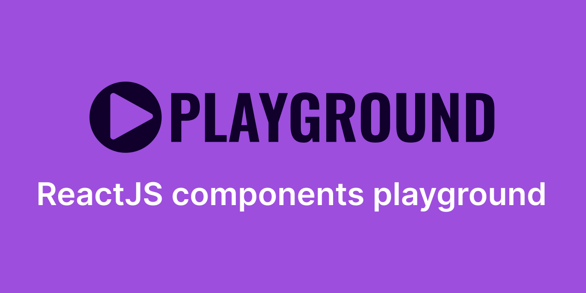

# Playground



`Playground` is a rehype plugin and React component that allows you to create rich and interactive code examples for your documentation or web application.

## Features

The `Playground` component provides the following features:

- Rule: Separates the example code from the rendered output.
- Show code: Allows the user to toggle the visibility of the example code.
- Copy code: Allows the user to copy the example code to their clipboard.
- Mobile, table, and desktop options: Provides options for displaying the example code and output in different formats depending on the device size.
- Error handling: Provides error handling for the example code and displays any errors that occur during code execution.

## Installation

To use `Playground`, you first need to install it as a dependency in your project:

```bash
npm install rehype-playground
```

```mdx
import Playground from 'rehype-playground';

import Button '...'

# Button

The `Button` component is a simple button that can be used in your application.

<Playground>
  <Button>Click me</Button>
</Playground>
```

## Compatibility

`Playground` is designed to work with MDX files and can be used in many React frameworks, including Next, Remix, Astro, and Gatsby. However, please note that `Playground` only works with ESM modules, and you may need to use the .mjs file extension in some configurations.

License
`Playground` is released under the MIT License. See LICENSE for more information.
